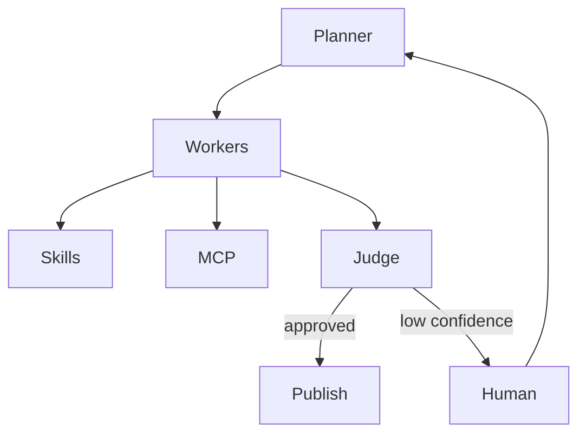

# Project Chimera – Architecture Strategy

## Objective
Define a practical, production-aligned architecture that satisfies the Project Chimera SRS while remaining achievable within a 3-day implementation window.

The design prioritizes:
- Reliability
- Spec fidelity
- Clear governance
- Simplicity over over-engineering

---

## 1. Selected Agent Pattern

### Pattern: Hierarchical Swarm (Planner → Worker → Judge)

This architecture follows the FastRender swarm pattern described in the SRS.

Roles:

Planner
- Decomposes goals into tasks
- Creates a task DAG
- Assigns work to workers

Worker
- Stateless execution of atomic tasks
- Uses MCP tools / skills
- No long-term responsibility

Judge
- Validates outputs
- Enforces safety rules
- Applies quality thresholds
- Escalates to Human-in-the-Loop when confidence is low

### Why this pattern

Chosen because it:
- Matches the SRS directly
- Enables parallelism
- Simplifies debugging
- Provides governance checkpoints
- Avoids complex peer-to-peer coordination

Alternatives considered:
- Single-agent chains → poor scalability
- Fully decentralized agents → weak control and higher risk

Therefore, hierarchical swarm provides the best tradeoff between complexity and reliability.

---

## 2. Human-in-the-Loop (Safety Layer)

Human approval is required at high-risk decision points.

Flow:

Judge → confidence score
If confidence < threshold → escalate to human review

Human responsibilities:
- approve content
- reject unsafe outputs
- override decisions

This ensures:
- brand safety
- compliance
- auditability

This aligns with SRS governance and safety requirements.

---

## 3. Data Storage Strategy

### Choice: SQL (PostgreSQL)

Reasoning:
- structured video metadata
- transactional integrity
- strong consistency
- easier schema enforcement
- predictable queries

NoSQL was rejected because:
- schema flexibility not required
- joins and relations are important

Optional:
Vector DB (Weaviate or similar) may be added later for semantic memory / RAG.

---

## 4. High-Level System Architecture

## 5. Core Components

### Planner

task decomposition

orchestration

### Workers

skill execution

### Skills

download_video

transcribe

post_social

### MCP

tool/resource gateway

logging and telemetry

### Database

video metadata

task state

execution history

## 6. Deliberate Simplifications (Time Constraints)

Due to time constarints

Deferred:

advanced dashboards

distributed messaging

real-time streaming

complex social integrations

Implemented first:

core swarm loop

skills interface

MCP logging

spec-driven design

These choices maximize reliability and evaluation score.

## 7. Conclusion

This architecture strictly follows the SRS while remaining lightweight enough for rapid implementation.

It balances:

* governance

* scalability

* maintainability

* time efficiency

The result is a safe, controlled, and extensible autonomous influencer system.