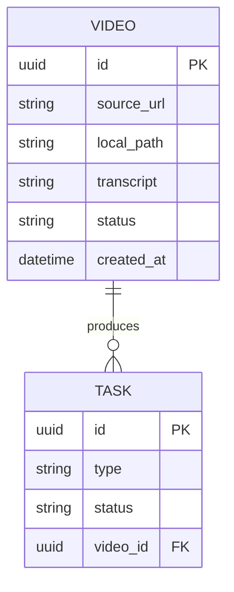

# Project Chimera – Technical Specification

This document defines the concrete technical contracts that govern agent interaction.

All implementations MUST follow these contracts.

---

# 1. Task Contract

Source of truth:
specs/schemas/task.json

Definition:
- id: unique identifier
- type: task type
- inputs: parameters
- expected_outputs: contract description

Example:

{
  "id": "task_123",
  "type": "download_video",
  "inputs": {
    "url": "https://example.com/video.mp4"
  }
}

---

# 2. Skill Interfaces

All skills must be:
- stateless
- deterministic
- JSON in / JSON out
- no hidden side effects

## download_video
Input:
{
  "url": "string"
}
Output:
{
  "file_path": "string"
}

## transcribe
Input:
{
  "file_path": "string"
}
Output:
{
  "transcript_text": "string"
}

## post_social
Input:
{
  "content": "string"
}
Output:
{
  "post_id": "string"
}

---

# 3. Planner → Worker Flow

1. Planner generates task list
2. Worker executes skill
3. Judge validates result
4. Approved outputs proceed
5. Low confidence escalates to human

---

# 4. Database Schema (Video Metadata)

Storage engine: PostgreSQL

Mermaid ER diagram:

---

# 5. Logging Requirements

All agent actions must:
- generate MCP telemetry
- record timestamps
- include task id
- include result status

Log file:
mcp_sense.log

---

# 6. Non-Functional Requirements

- reproducible environment
- tests runnable via make test
- containerized execution
- clear commit history
- spec alignment mandatory

---

# 7. Compliance Rules

Implementations MUST:
- match schema definitions exactly
- not change contracts without updating specs
- pass tests before submission

If code conflicts with specs → specs are authoritative.

---

# Summary

These contracts define the formal interface between agents, tools, and storage.
All development must conform strictly to these definitions.