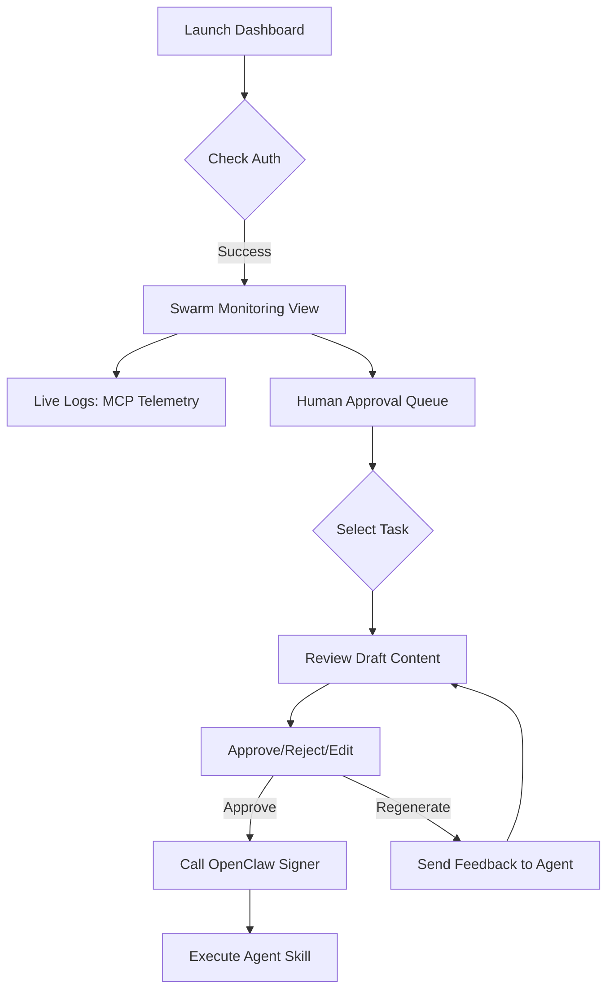

# UI Flow: Chimera Command Center

**Owner:** Lead FDE
**Objective:** Provide a high-fidelity interface for monitoring agent autonomy and providing human intervention.

## 1. Visual Design Philosophy
The UI should reflect a "Mission Control" aesthetic: dark mode, high-density data, and real-time telemetry feeds.

## 2. Interaction Model (Mermaid Diagram)

## 3. Page Specifications
Dashboard (Main View)
Component: Health Pulse. Shows system_health and active_agents count.

Component: Swarm Feed. A scrolling list of agent "thoughts" parsed from the Tenx MCP Sense telemetry.

Action: Click on an Agent ID to see its local state and memory.

Approval Center (HITL View)
Table View: Displays task_id, agent, and risk_score.

Detail Modal:

Displays the proposed post/transaction.

Displays the Agent's Reasoning ("I chose this because $SOL increased 5% in 1 hour").

Control Group: Large Green "Approve" button, Red "Abort" button.

## 4. Responsiveness & Latency
The UI must poll /swarm/status every 5 seconds.

Human decisions must be acknowledged within <200ms to maintain Orchestrator flow.